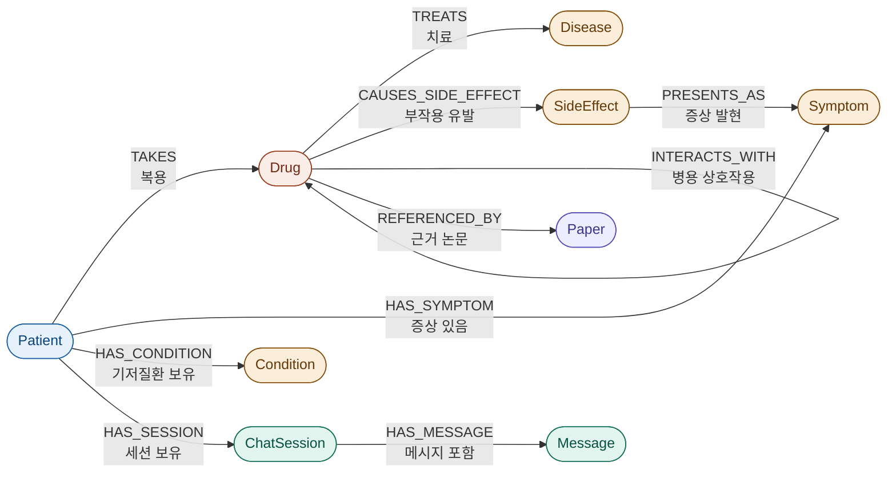

# 💊 약한AI — 정신과 복약 관리 챗봇

LangGraph 기반, Personal Graph(PGHD) + Medical Graph(Drug-Disease-Paper)를 결합한
설명 가능(Explainable) 개인화 복약 상담 챗봇입니다. 정신과 의사(AI)와 환자(사용자)의 역할로
대화할 수 있습니다.

<br>

<p align="center">
  
</p>

<br>

| 이름 | 역할 | 담당 업무 |
|:----:|:----:|-----------|
| 김봉남 | 팀장 👑 | - |
| 이영창 | 팀원 | - |
| 박하린 | 팀원 | - |
| 이재일 | 팀원 | - |

## 아키텍처

```
사용자 자연어 건강기록 입력
        │
LLM Entity/Relation Extraction (Pydantic Structured Output)
        │
   ┌────┴────┐
Personal Graph   Medical Graph
  (PGHD)        (Drug-Disease-Paper)
   └────┬────┘
Graph Retriever (Graph + Vector Hybrid) → 관련 Subgraph 생성
        │
       LLM
        │
Explainable Personalized Answer
```

## 기술 스택

| 구성 요소 | 기술 |
|---|---|
| Agent Workflow | LangGraph |
| LLM | GPT-5.5 (기본) / Claude (선택) |
| Personal Graph | Neo4j |
| Medical Graph | Neo4j |
| Vector DB | Qdrant |
| Embedding | text-embedding-3-large |
| Entity Extraction | Structured Output (Pydantic) |
| Retriever | Graph + Vector Hybrid |
| Frontend | Streamlit |

## 폴더 구조

```
psych_med_chatbot/
├── app.py                    # Streamlit 프론트엔드
├── workflow.py               # LangGraph 상태 그래프 정의
├── retriever.py              # Graph+Vector 하이브리드 리트리버
├── llm_client.py             # LLM 호출 (엔티티 추출 / 답변 생성)
├── schemas.py                # Pydantic 스키마 (Entity, Relation, ChatState 등)
├── config.py                 # 환경설정 로더
├── db/
│   ├── personal_graph_db.py  # PGHD Neo4j 커넥터 (mock 포함)
│   ├── medical_graph_db.py   # 의학 그래프 Neo4j 커넥터 (mock 포함)
│   └── vector_db.py          # Qdrant 커넥터 (mock 포함)
├── image/
│   └── profile2.png          # readme profile
├── requirements.txt
└── .env.example
```
## 프로젝트 WBS

---

## 시스템 아키텍처 구성

### Qdrant Vector DB 메타데이터 스키마

| 필드명 (Key) | 데이터 타입 | 예시 값 | 설명 |
| --- | --- | --- | --- |
| `ingredient_code` | `String` | `"626402ATR"` | 의약품 식별 고유 코드 |
| `section` | `String` | `"효능효과"`, `"용법용량"`, `"1. 경고"` | 약학 정보의 대분류/소분류 타이틀 |


### 🏗️ Vector DB 파이프라인
```
[ Raw Data Source ]
        │  data/medicine_new.xlsx
        ▼
┌──────────────────────────────────────────────┐
│ 1. Data Parsing & Chunking (document.py)     │
│  · 엑셀 데이터를 Document 객체로 변환         │
│  · 긴 텍스트는 max_len(800자) 기준 안전 분할  │
│  · 청크별 고유 메타데이터 부여                │
│    (ingredient_code, section)                │
└──────────────────┬───────────────────────────┘
                   │ Document Objects
                   ▼
┌──────────────────────────────────────────────┐
│ 2. Embedding & Rate Limit Shield             │
│    (vectorstore.py)                          │
│  · OpenAI Embeddings                         │
│    (text-embedding-3-large)                  │
│  · BATCH_SIZE = 100                          │
└──────────────────┬───────────────────────────┘
                   │ Dense Vectors + Payload
                   ▼
┌──────────────────────────────────────────────┐
│ 3. Vector Database Layer                     │
│    (Qdrant on Docker)                        │
│  · Port: 6333                                │
│  · Collection: medical_docs                  │
│  · 임베딩 벡터 + 메타데이터(Payload) 동시 저장│
└──────────────────┬───────────────────── ─────┘
                   │ Similarity Search with Filters
                   ▼
┌──────────────────────────────────────────────┐
│ 4. Retrieval & Filtering Module              │
│    (retriever.py)                            │
│  · 사용자 질의 기반 고속 시맨틱 검색          │
│  · ingredient_code + section 조합 필터 쿼리  │ 
└──────────────────────────────────────────────┘
```
---
### 🏗️ GraphDB(Neo4J) DB 설계

본 프로젝트는 **Personal Graph**와 **Medical Graph**를 Neo4j에서 함께 관리하여 환자의 복약 정보와 의료 지식을 연결하는 Explainable RAG 구조를 사용합니다.

---

## GraphDB 구성도

```text
                    ┌──────────────┐
                    │   Disease    │
                    └──────▲───────┘
                           │ TREATS
                    ┌──────┴───────┐
                    │    Drug      │
                    └───┬─────┬────┘
                        │     │
       CAUSES_SIDE_EFFECT│     │INTERACTS_WITH
                        │     │
                        ▼     ▼
                 ┌──────────┐  Drug
                 │SideEffect│
                 └────▲─────┘
                      │ PRESENTS_AS
                      ▼
                 ┌──────────┐
                 │ Symptom  │
                 └────▲─────┘
                      │ HAS_SYMPTOM
             ┌────────┴────────┐
             │     Patient      │
             └─┬─────┬──────┬───┘
               │     │      │
         TAKES │     │      │HAS_SESSION
               ▼     ▼      ▼
            Drug  Condition ChatSession
                            │
                     HAS_MESSAGE
                            ▼
                        Message
```
## GraphDB 구성도 설명

본 프로젝트의 GraphDB는 **Personal Graph**와 **Medical Graph**를 하나의 Neo4j 데이터베이스에서 연결하여 관리한다. **Patient** 노드를 중심으로 환자의 복약 정보, 증상, 기저질환, 상담 이력을 저장하며, **Drug** 노드는 질환(Disease), 부작용(SideEffect), 약물 상호작용(Drug), 의학 논문(Paper) 등 의료 지식과 연결된다.

환자가 복용 중인 약물은 **TAKES** 관계를 통해 Drug 노드와 연결되며, 해당 약물은 **TREATS** 관계로 치료 가능한 질환을, **CAUSES_SIDE_EFFECT** 관계로 발생 가능한 부작용을 나타낸다. 또한 부작용은 **PRESENTS_AS** 관계를 통해 실제 환자에게 나타나는 증상(Symptom)과 연결되어, 특정 증상이 질환에 의한 것인지 약물 부작용에 의한 것인지 분석할 수 있다.

환자의 건강 상태는 **HAS_SYMPTOM** 관계를 통해 현재 증상(Symptom)과 연결되고, **HAS_CONDITION** 관계를 통해 기저질환(Condition)을 관리한다. 상담 기록은 **HAS_SESSION** 관계를 이용해 ChatSession과 연결되며, 각 상담 세션은 **HAS_MESSAGE** 관계를 통해 여러 개의 Message 노드를 저장하여 대화 이력을 관리한다.

또한 약물 간 병용금기 및 상호작용은 **INTERACTS_WITH** 관계로 표현하며, 약물의 효능과 안전성에 대한 근거 자료는 **REFERENCED_BY** 관계를 통해 의학 논문(Paper)과 연결된다.

이와 같은 그래프 구조를 통해 **환자의 개인 건강 정보(Personal Graph)**와 **의료 지식(Medical Graph)**를 함께 탐색할 수 있으며, Graph Retriever는 사용자 질문과 관련된 Subgraph를 생성하여 LLM에 전달한다. 이를 통해 단순한 정보 검색을 넘어 **개인 맞춤형 복약 상담**, **약물 상호작용 분석**, **부작용 예측**, **의학적 근거를 포함한 Explainable RAG 응답**을 제공할 수 있다.


## Node 설계

| Node | 역할 | 주요 Property |
|------|------|--------------|
| Patient | 환자의 개인정보 및 건강정보를 저장하는 중심 노드 | patient_id, name, age, gender |
| Drug | 환자가 복용하는 약물 정보 | drug_name, ingredient_code, category |
| Disease | 약물이 치료하는 질환 정보 | disease_name |
| SideEffect | 약물의 부작용 정보 | side_effect_name |
| Symptom | 환자가 경험하는 증상 | symptom_name |
| Condition | 환자의 기저질환 | condition_name |
| ChatSession | 하나의 상담 세션 관리 | session_id, created_at |
| Message | 상담 중 발생한 대화 저장 | role, content, timestamp |
| Paper | 의학 논문 및 근거 문헌 | title, year, doi |

## Relationship 설계



**노드 카테고리**
- 🔵 환자 (Patient)
- 🟠 약물 (Drug)
- 🟡 질환·증상·부작용 (Disease / SideEffect / Symptom / Condition)
- 🟢 상담 기록 (ChatSession / Message)
- 🟣 논문 (Paper)

## Property 설계

| Node | Properties |
|---|---|
| **Patient** | `patient_id`(String, 환자 고유 ID) · `name`(String, 이름) · `age`(Integer, 나이) · `gender`(String, 성별) · `pregnancy`(Boolean, 임신 여부) |
| **Drug** | `drug_id`(String, 약물 고유 ID) · `drug_name`(String, 약물명) · `ingredient_code`(String, 주성분 코드) · `category`(String, 약물 계열(SSRI 등)) · `dosage`(String, 복용 용량) |
| **Disease** | `disease_name`(String, 질환명) |
| **SideEffect** | `side_effect_name`(String, 부작용명) · `frequency`(String, 발생 빈도) |
| **Symptom** | `symptom_name`(String, 증상명) · `severity`(Integer, 증상 심각도) |
| **Condition** | `condition_name`(String, 기저질환명) |
| **ChatSession** | `session_id`(String, 상담 세션 ID) · `created_at`(DateTime, 생성 시간) |
| **Message** | `message_id`(String, 메시지 ID) · `role`(String, patient / assistant) · `content`(Text, 대화 내용) · `timestamp`(DateTime, 작성 시간) |
| **Paper** | `title`(String, 논문 제목) · `year`(Integer, 출판 연도) · `doi`(String, DOI 식별자) |

## GraphDB 활용

- 환자의 복약 정보와 의료 지식을 하나의 그래프로 연결
- 약물 부작용 및 병용금기 탐색
- 증상과 질환·부작용의 관계 분석
- 상담 이력 기반 개인 맞춤형 답변 생성
- Graph Retriever를 통한 Explainable RAG 구현


## RAG 시스템 구성도 ****

---

## 📁 데이터 수집 출처

### 1.  정신질환 약물 데이터

약학정보원(https://health.kr/) 크롤링 수집

| 단계 | 내용 | 출처 |
| --- | --- | --- |
| ① | 건강보험심사평가원_ATC코드 매핑 목록 (분류번호, 주성분코드, 제품코드/명, 업체명, ATC코드/명) | [링크](https://www.data.go.kr/data/15118958/fileData.do) |
| ② | 국민건강보험공단_주요 정신신경계 질환 환자 약 처방 현황 (약제주성분코드는 zip 내 메모장 참고) | [링크](https://www.data.go.kr/data/15143145/fileData.do) |
| ③ | ① + ② 매핑 → 정신신경계 질환 관련 약물 **274종** 추출 | - |
| ④ | 약학정보원 크롤링 (Selenium + BeautifulSoup4 하이브리드 동적 크롤링) → **265건** 추출 | - |

---

### 2.병용금기 데이터
**건강보험심사평가원_의약품안전사용서비스(DUR) 의약품 목록** (20260601 기준)

- **출처**: [공공데이터 포털](https://www.data.go.kr/data/15127983/fileData.do)
- **형식**: CSV

> DUR(Drug Utilization Review, 의약품안전사용서비스)은 처방·조제 시 환자가 현재 복용 중인 약과의 중복 여부 등 의약품 안전정보를 요양기관에 실시간으로 제공하는 서비스입니다. 본 데이터는 DUR 시스템에 적용 중인 **병용금기 · 연령금기 · 임부금기 · 노인주의** 의약품 품목 정보를 포함합니다.
